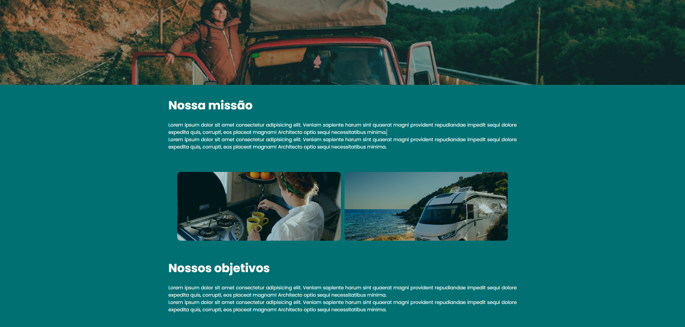

# TripNavigator


## Sobre o Projeto

**TripNavigator** é um projeto simples desenvolvido em **React**, com o objetivo de oferecer uma experiência intuitiva para navegar e explorar informações sobre viagens. 

### Páginas do site:
- **Landing Page**: Página inicial do projeto com uma introdução visual e CTA.
- **Home**: Página principal com informações gerais sobre destinos e viagens.
- **About Us**: Informações sobre a equipe ou organização por trás do site.
- **Contacts**: Seção de contato com informações relevantes.

---

## Demonstração
Aqui estão algumas capturas de tela do projeto em funcionamento:

### Landing Page


### Home
 
 

### Sobre


### Contato


---

## Como executar o projeto

Siga os passos abaixo para rodar o projeto localmente:

### Pré-requisitos
Certifique-se de ter o seguinte instalado:
- **Node.js** (versão 16 ou superior)
- **npm** (gerenciador de pacotes do Node.js)

### Passos
1. Clone este repositório:
   ```bash
   git clone https://github.com/seu-usuario/tripnavigator.git
   ```

2. Navegue até o diretório do projeto:
   ```bash
   cd tripnavigator
   ```

3. Instale as dependências:
   ```bash
   npm install
   ```

4. Inicie o servidor de desenvolvimento:
   ```bash
   npm start
   ```

5. Abra o navegador e acesse:
   ```
   http://localhost:5173/
   ```

---

## Tecnologias Utilizadas
- **React**: Biblioteca principal para construção da interface.
- **CSS**: Estilização das páginas.
- **React Router**: Para navegação entre as páginas.

---

## Estrutura Básica de Pastas

```bash
tripnavigator/
├── public/
├── src/
│   ├── assets/      
│   ├── pages/
│   ├── routes/
│   ├── ui/
│   ├── App.jsx           
│   ├── index.html
│   ├── main.jsx
├── package.json        
```

---

## Contribuições
Contribuições são bem-vindas! Sinta-se à vontade para abrir issues e enviar pull requests.

1. Faça um fork do projeto
2. Crie uma branch para a sua funcionalidade: `git checkout -b minha-funcionalidade`
3. Faça o commit das suas alterações: `git commit -m 'Adicionei uma nova funcionalidade'`
4. Envie para a branch principal: `git push origin minha-funcionalidade`
5. Abra um Pull Request

